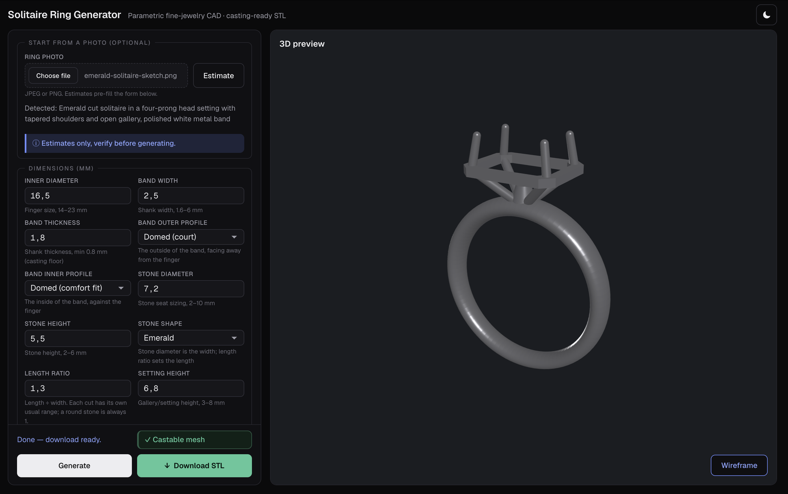
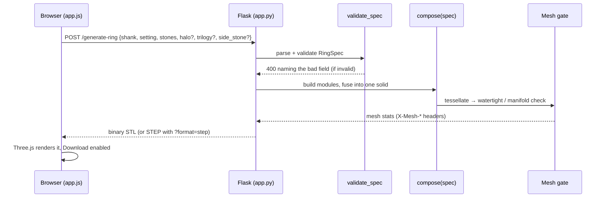

# Ring CAD

Parametric jewelry-ring generator. Enter ring parameters (or upload a photo),
and the app generates a watertight 3D model in-process with build123d (an
OpenCASCADE B-rep kernel), validates the mesh, previews it in the browser, and
exports a clean STL (and STEP) ready for lost-wax casting. A ring is a centre
stone on a band plus **any combination of a halo, trilogy side stones and a
side-stone band**, with six centre-stone cuts (round, oval, cushion, emerald,
pear, marquise) and six band cross-sections.

## Features

- **Parametric geometry** — every ring is a composition of reusable build123d
  modules (`shank`, `seat`, `prong_setting`, `bezel`, `gallery`,
  `accent_seat`, `accent_prong`, …) fused into one watertight manifold.
  Features compose freely (a halo *and* side-stone shoulders on one ring), and a
  pluggable `StoneOutline` seam makes the stone cut orthogonal to the modules
  that follow it.
- **Typed contract (RingSpec)** — requests are validated against a versioned,
  typed RingSpec schema; castability is checked *before* any geometry runs.
- **Casting-ready output** — manufacturing limits (min wall 0.8 mm, min prong tip
  0.7 mm, single watertight body, zero non-manifold edges) are enforced in the
  geometry, not just hinted in the UI.
- **Mesh validation** — geometry is watertight by construction; every generated
  STL is still checked for castability, with conservative repair (no remeshing)
  as a fallback. The verdict rides back on response headers and a green/red
  indicator.
- **STL + STEP export** — STL for print/preview, STEP for CAD interchange.
- **3D preview** — the centre piece of a single-view workspace: a Three.js viewer
  with orbit/zoom/pan and a wireframe toggle, beside a sidebar holding the form.
- **Photo-assisted entry (optional)** — upload a ring photo and Claude vision
  detects the ring's features, stone cut and proportions, and populates a full,
  schema-valid RingSpec that pre-fills the form. The form is a correction
  surface, not a configurator: every value stays editable, each detected feature
  has a Remove, low-confidence fields are flagged, and any value adjusted to make
  the estimates buildable together is marked. Works without an API key (degrades
  gracefully to manual entry).

## Screenshots



## Architecture

A `/generate-ring` request, end to end:



## Stack

| Layer                | Tech                                           |
| -------------------- | ---------------------------------------------- |
| Geometry kernel      | build123d (in-process OpenCASCADE B-rep)       |
| Contract / IR        | RingSpec (Pydantic v2, versioned + typed)      |
| Backend              | Python + Flask (in-process, no subprocess)     |
| Mesh validation      | trimesh (watertight check + auto-repair)       |
| Frontend             | Single HTML page, vanilla JS (no frameworks)   |
| 3D preview           | Three.js + OrbitControls (vendored, no CDN)    |
| Photo classification | Claude vision API (Haiku 4.5)                  |

## Requirements

- **Python 3.11+**
- Python dependencies in `requirements.txt` (build123d, trimesh, Flask, pydantic —
  all pip-installable; no external CAD binary required).

## Setup

```bash
python3 -m venv .venv
source .venv/bin/activate
pip install -r requirements.txt
```

## Run

```bash
# Dev server (http://127.0.0.1:5000)
flask --app ringcad.app run
# or:
python app.py
```

Open <http://127.0.0.1:5000>, enter the parameters (or choose a photo and click
**Estimate**), click **Generate**, then preview and download the STL.

> Note: the built-in Flask server is for development only. Use a production WSGI
> server (gunicorn/uWSGI) to deploy.

## Configuration (environment variables)

| Variable            | Default            | Purpose                                                                                                                       |
| ------------------- | ------------------ | ----------------------------------------------------------------------------------------------------------------------------- |
| `ANTHROPIC_API_KEY` | _(unset)_          | Enables photo classification. **Optional** — without it, photo upload returns a graceful "enter parameters manually" message. |
| `CLASSIFY_MODEL`    | `claude-haiku-4-5` | Claude model used for photo classification                                                                                    |

The Anthropic key is read server-side only and is never sent to the browser. To
enable photo classification, add it to a local `.env` file (gitignored) — the app
loads it at startup via `python-dotenv`:

```
ANTHROPIC_API_KEY=sk-ant-...
```

An explicit environment export also works and takes precedence over `.env`:

```
export ANTHROPIC_API_KEY=sk-ant-...
```

## Ring parameters

The shared core (the solitaire's slice of RingSpec):

| Parameter        | Notes                         |
| ---------------- | ----------------------------- |
| `inner_diameter` | Finger size (mm)              |
| `band_width`     | Shank width (mm)              |
| `band_thickness` | Shank thickness (mm, >= 0.8)  |
| `outer_profile`  | Band outside: `domed` / `flat` / `knife_edge` |
| `inner_profile`  | Band inside: `domed` (comfort fit) / `flat` |
| `stone_diameter` | Stone seat sizing (mm; the width for elongated cuts) |
| `stone_height`   | Stone height (mm)             |
| `prong_count`    | 4 or 6 only                   |
| `setting_height` | Gallery / setting height (mm) |

Centre stones also take a `shape` (`round`, `oval`, `cushion`, `emerald`,
`pear`, `marquise`) and, for elongated cuts, a `length_ratio` (length ÷ width).
Optional feature groups add on top, in any combination: `halo` (accent
size/count/gap), `trilogy` (side-stone size/gap), `side_stone` (accent row +
`retention`, `channel` only for now). Features are put on a ring by the photo;
the form shows each detected one with a **Remove**, and offers no way to add one.

Defaults and sane ranges live in `docs/parameter-ranges.md`. The RingSpec contract
(`docs/ringspec/`) validates types and ranges; non-castable specs (e.g. a wall
under 0.8 mm) are rejected with a structured error before geometry runs.

## API

| Endpoint              | Description                                                                                                                                  |
| --------------------- | -------------------------------------------------------------------------------------------------------------------------------------------- |
| `GET /`               | The single-page app                                                                                                                          |
| `GET /health`         | `{"status": "ok"}`                                                                                                                           |
| `POST /generate-ring` | Accepts a structured RingSpec JSON body (`shank` / `setting` / `stones` plus any of `halo` / `trilogy` / `side_stone`; a legacy `archetype` tag is still accepted and translated) — or, for back-compat, the flat 7 solitaire params. Returns a binary STL (`model/stl`) with `X-Mesh-Valid` / `X-Mesh-Repaired` headers. `?format=step` returns STEP (`model/step`). Non-castable or malformed input returns a 400 JSON error naming the field. |
| `POST /classify-ring` | Accepts an image (multipart `image`); returns `{ring_detected, detected_style, note, spec, adjustments}` where `spec` is a validated, buildable RingSpec with per-field confidence and `adjustments` lists any field changed to make it castable; 503 if no API key is configured |

Example:

```bash
curl -s -D - -o ring.stl -X POST http://127.0.0.1:5000/generate-ring \
  -H "Content-Type: application/json" \
  -d '{"inner_diameter":16.5,"band_width":2.2,"band_thickness":1.9,
       "stone_diameter":6.5,"stone_height":4,"prong_count":6,"setting_height":6}'

# STEP export
curl -s -o ring.step -X POST "http://127.0.0.1:5000/generate-ring?format=step" \
  -H "Content-Type: application/json" -d '{...same body...}'
```

## Tests

```bash
source .venv/bin/activate
pytest -q
```

Geometry tests build real B-rep solids in-process (a few seconds each); photo
classification tests mock the Anthropic client (no key or network required).

### Photo fidelity probe

The suite never calls the live vision API. To check what the app actually does
with real photos — the measure for every "this looks closer to the photo" change
— run the probe:

```bash
python probes/fidelity_probe.py
```

It runs a committed corpus through the real upload-to-generate path and reports
per photo. Costs one Anthropic call each (~$0.003); skips cleanly with no key.
See [probes/README.md](probes/README.md).

## Project layout

```
app.py                  # repo-root entrypoint (create_app)
ringcad/
  app.py                # Flask app factory + routes
  params.py             # request validation (thin view over RingSpec)
  ringspec/             # RingSpec: typed/versioned contract + castability
  geometry/             # build123d module library + archetype compositions + export
  mesh_validator.py     # trimesh validation + auto-repair
  classify.py           # Claude vision ring classification
templates/index.html    # single-page UI
static/                  # app.js, photo.js, viewer.js, styles.css, vendored three
docs/                    # parameter ranges, RingSpec contract, per-ticket specs
tests/                   # pytest suite
probes/                  # developer probes (live API, never run by pytest)
  fidelity_probe.py      # photo corpus -> real classify/generate path -> report
  corpus/                # committed ring photos + manifest
```

## Casting requirements (lost-wax)

Hard manufacturing constraints, enforced in geometry:

- Minimum wall thickness **0.8 mm** throughout
- Minimum prong tip diameter **0.7 mm**
- All modules union into a **single watertight manifold**
- Exported STL has **zero non-manifold edges**
- Mesh validated after every generation; auto-repair attempted if not watertight
